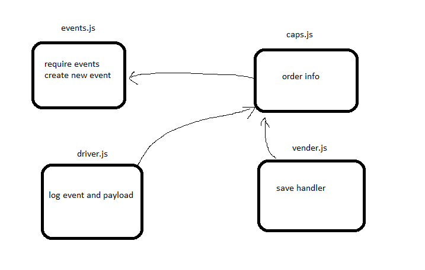

# caps

## Project: caps

### Author: Anas Zain

### Links and Resources

- [submission PR]()
- [Heroku]()

### Modules
#### `index.js`

### Setup

#### How to initialize/run your application 

- `node index.js`
- `nodemon`

#### How to use your library 
#### Tests
- Lint test: `npm run lint`
- Code test: `npm run test`

#### UML

